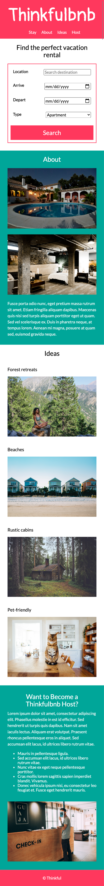
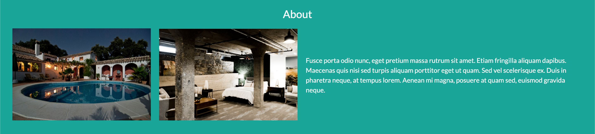

# Thinkfulbnb

Thinkfulbnb is a vacation rental website that allows people to rent out their homes to people who are seeking short-term accommodations in that locale. Thinkfulbnb hosts rent out different kinds of properties, including single rooms, apartments, and unique living spaces such as yachts, houseboats, yurts, tiny houses, and even renovated medieval castles.

https://faisalkb.github.io/thinkfulbnb/

For this project, I implemented Thinkfulbnb's landing page in HTML & CSS.

## Thinkfulbnb views

The UX designer provided the following user interface mockups:

### Mobile view

### Desktop view

### Existing files

| File         | Description                                                             |
| ------------ | ----------------------------------------------------------------------- |
| `images/`    | A folder containing all the images used for the design.                 |
| `index.html` | The website's HTML File.                                                |
| `style.css`  | The website's css file.                                                 |

### Mobile-First Approach (Progressive Enhancement)

For this project, I followed a mobile-first development approach that involves designing for the smallest screen first, then progressively adding features and rearranging the layout to take advantage of larger screen sizes. As it turns out, progressive enhancement ensures that there is a good enough user experience on all screens. Designing your pages to work on smaller screens first is the generally accepted approach to making web pages today.

#### Navigation

- **Single-page navigation**: Clicking on each link will take the user to the corresponding sections on the page, as follows:

| Link clicked | Take the user to the section with `id` of |
| ------------ | ----------------------------------------- |
| `Stay`       | `id="stay"`                               |
| `About`      | `id="about"`                              |
| `Ideas`      | `id="ideas"`                              |
| `Host`       | `id="host"`                               |

#### HTML form

- In the "Find your perfect vacation rental" section, I've created an HTML form that contains the following input fields with the specified types:

  - `Location`: `text` input type, with a placeholder value of "Search destination"
  - `Arrive`: `date` input type
  - `Depart`: `date` input type
  - `Type`: a dropdown list with the following options:
    - Apartment
    - Barn
    - Castle
    - Houseboat
    - Tiny House
    - Yacht
    - Yurt
  - a `"Search"` button

#### Vertical content alignment

- The content in the remainder of the sections (i.e., "About", "Ideas", "Want to become a Thinkfulbnb Host?"), including any text and images, stack on top of each other. Refer to the mobile design shared above.

#### Responsive images

- Images will match whatever container width they are placed within, and changing the container sizes will update the image sizes appropriately.

#### Media query: Desktop view

Now that the mobile design is looking good, we will need to adapt the design for the desktop view.

- In `style.css`, I created a media query for screens that are wider than `480px`.

Within the media query, I wrote CSS to create the following designs for desktop:

- The logo and the navigation menu links are spaced apart from each other, like this:

- The search form input fields and the button are horizontally aligned, like this:

- The items in the "About" section are horizontally aligned. The paragraph content is vertically centered and is always about twice as wide as each image item, like this:

- The "Ideas" images are displayed in a 2 by 2 grid (see the desktop design shared above).

- The items in the "Want to Become a Thinkful Host?" section are horizontally aligned. The paragraph content is vertically centered and is as wide as each image item, like this:

